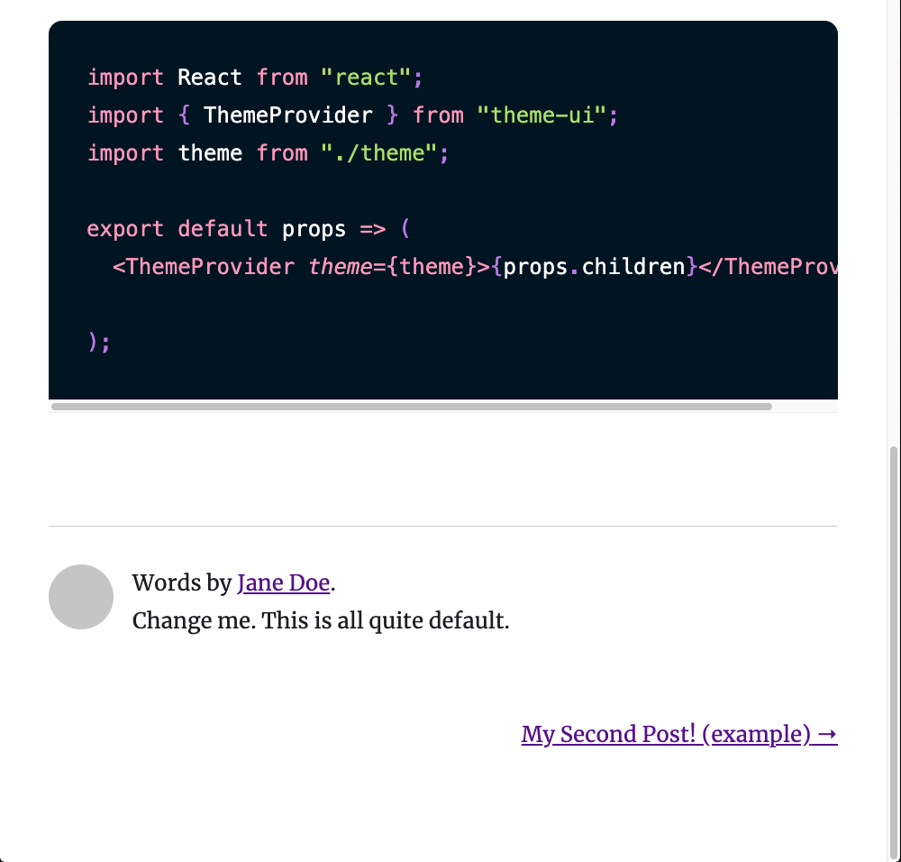
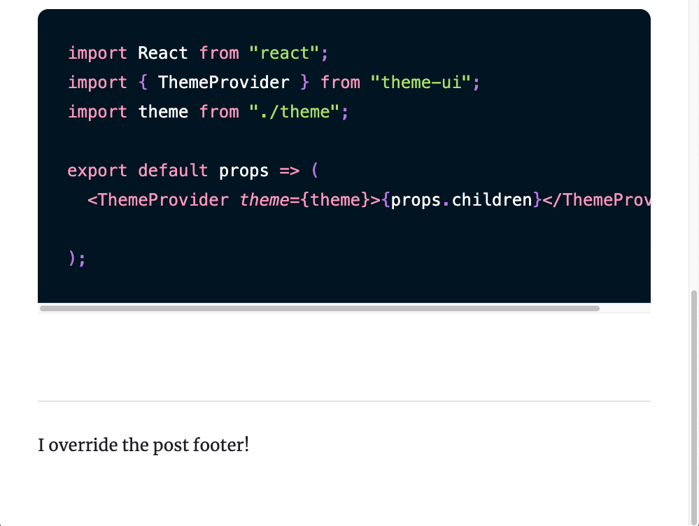

This is a theme example of using the original import paths when shadowing multiple files.

There are two shadowed files, both of which import files from the original theme (`gatsby-theme-blog` in this case). They are

- src/gatsby-theme-blog/components/post.js
- src/gatsby-theme-blog/components/post-footer.js

They shadow the respective files in `gatsby-theme-blog`:

- node_modules/gatsby-theme-blog/src/components/post.js
- node_modules/gatsby-theme-blog/src/components/post-footer.js

In our shadowed `post.js`, we import the original path from the theme to get `post-footer.js`.

```js
import PostFooter from "gatsby-theme-blog/src/components/post-footer";
```

The result of this is that we get the return value of the shadow context for that import path.

Before shadowing:



After shadowing:



[TODO: Link to Shadow Contexts blog post](https://www.christopherbiscardi.com/post)

---

This illustrates that you don't have to change your import paths to be `../../gatsby-theme-blog/components/post-footer.js` if you are shadowing multiple files. Importing from `gatsby-theme-blog/src/components/post-footer.js` allows your component to be resilient to changes in whether the original `post-footer` is shadowed or not.
